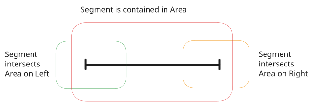

## Posizionamento Grafico

Un [TrackSegment](Oggetti/TrackSegment.md) rappresenta un segmento di binario, questo è rappresentato da un segmento, definito da un punto di sinistra e un punto di destra. Una [Entity](Oggetti/Entity.md) è un oggetto astratto che rappresenta qualsiasi elemento del piano schematico, una Entity puo essere collegata ad un [TrackSegment](Oggetti/TrackSegment.md), la sua posizione geometrica è rappresentata da un punto nello spazio, per questioni di rappresentazione grafica, il suo simbolo puo essere rovesciato sull’asse X (ad esempio, per cambiare l’informazione di direzione) o sull’asse Y (permettendo di posizionarlo sopra o sotto un [TrackSegment](Oggetti/TrackSegment.md) o altro elemento).  Una [Area](Oggetti/Area.md) rappresenta una area di caratterizzazione del piano schematico, è rappresentata da un insieme di segmenti che connessi tra loro che formano un poligono chiuso, ogni [Area](Oggetti/Area.md) ha un punto o segmento di inizio. 
## Intersezione e Contenimento

Queste informazioni geometriche possono interagire tra di loro attraverso contenimento o intersezione. Nello specifico:

- Una [Entity](Oggetti/Entity.md) puo intersecarsi o essere contenuta in una [Area](Oggetti/Area.md)
- Una [Area](Oggetti/Area.md) puo intersecarsi o contenere una Entity o un [TrackSegment](Oggetti/TrackSegment.md)
- Un [TrackSegment](Oggetti/TrackSegment.md) puo essere intersecato con una [Area](Oggetti/Area.md) a sinistra o a destra
### Interazione TrackSegment e Area

Riguardo la geometria dei [TrackSegment](Oggetti/TrackSegment.md) rispetto alle [Area](Oggetti/Area.md) definiamo la seguente semantica:
- Se il punto di inizio del segmento è contentuto in una area, si dice che il segmento interseca a destra con l’area
- Se il punto di fine del segmento è contenuto in una area si dice che il segmento interseca a sinistra con l’area
- Se il punto di destra e di sinistra sono entrambi in una area, si dice che il segmento è contenuto nell’area

