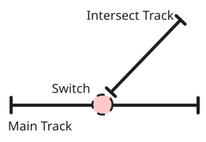
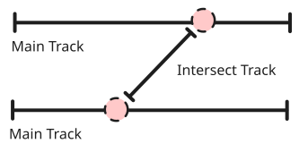

Uno Switch (Deviatoio) è una tipologia di [Entity](Entity.md) che presenta informazione di [Direzionalità](../Direzionalità.md) e un posizionamento fisico sul piano schematico tramite [Kilometric Point](../Kilometric_Point.md).  Uno Switch rappresenta un punto di incrocio tra più [TrackSegment](TrackSegment.md) presenta quindi solitamente collegamento a due tipologie diverse di [TrackSegment](TrackSegment.md)

- **Segmento Principale**: Rappresenta il [TrackSegment](TrackSegment.md) su cui poggia lo switch. 
- **Segmento Intersecato**: Rappresenta il [TrackSegment](TrackSegment.md) che incrocia il segmento principale.

  

Il segmento intersecato può essere riconosciuto all'interno dei dati con la dicitura `TrackSegment Reverse ID`.  Ci sono casi in cui due switch possono **comunicare** tra di loro come nell'immagine di riferimento:

In questi casi, si tiene conto dell'informazione di comunicazione tra gli switch. In base alla tipologia di connessione di un deviatoio, si indetificano le seguenti categorie:

- **CommunicateSwitch**: Se lo Switch comunica con un altro Switch
- **VirtualCommunicateSwitch**: Se lo Switch comunica on uno [VirtualSwitch](VirtualSwitch.md)

Due deviatoi comunicanti devono avere un percorso di [TrackSegment](TrackSegment.md) tra di loro. L'informazione della [Direzionalità](../Direzionalità.md) non è sempre presente, in alcuni casi, va analizzata la presentazione grafica o la [Geometria](../Geometria.md) dell'oggetto (analizzando ad esempio la simmetria) per inferire la direzione del deviatoio

se abbiamo un double slip abbiamo due deviatoi connessi tra di loro (diverso da comunicazione di due deviatoi) lo slip puo essere di diversi tipi e mette in connessione sempre ude deviatori, con specifiche di connessione e parametri diversi (futuro)

uno switch puo essere connesso ad un virtual switch che potrebbe essere vista come una forma di comunicazione come nelle connessioni tra switch e switch 

anche in questo caso ci deve essere un percorso 

una sottocategoria di deviatorio è il fermadeviatoio, questa specifica tipologia deve avere un insieme di “trasmetti chiave list” 

  

## Gerarchia Classi Switch

- [StopSwitch](StopSwitch.md): con attributo di chiave 
- [SlipSwitch](SlipSwitch.md): se è in connessione slip con un altro slip deviatorio 
- [VirtualSwitch](VirtualSwitch.md): ?

    